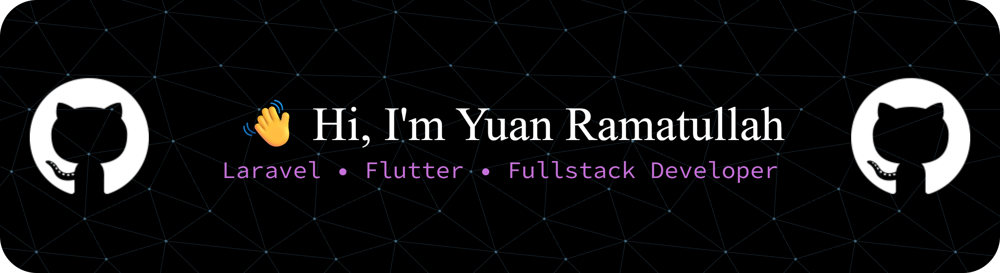

 

---

# 📊 GitHub Analytics

  

---

# 💻 Tech Stack

---

# ⚡ Development Journey

---

# 🚀 Featured Projects

| 🚀 Project | 📖 Description |
|---|---|
| 🚜 Rakentra | Heavy equipment rental management system using Laravel & MySQL |
| 🏠 Perumahan App | Housing management application |
| 🎫 Ticket Reservation | Reservation system application |
| 📱 Flutter Applications | Mobile applications integrated with Firebase |
| 🔔 Firebase Notification App | Push notification system using Firebase Cloud Messaging |

---

# 🛠 Tools & Platforms

---

# 🐍 Contribution Snake

<picture>

  <!-- Dark Mode -->
  <source
    media="(prefers-color-scheme: dark)"
    srcset="https://raw.githubusercontent.com/ramatullah12/ramatullah12/output/github-contribution-grid-snake-dark.svg"
  />

  <!-- Light Mode -->
  <source
    media="(prefers-color-scheme: light)"
    srcset="https://raw.githubusercontent.com/ramatullah12/ramatullah12/output/github-contribution-grid-snake.svg"
  />

  <!-- Default -->
  

</picture>

---

# 📫 Connect With Me

---

### ✨ Clean Code • Modern UI • Scalable Systems

⭐ Thanks for visiting my GitHub Profile ⭐

